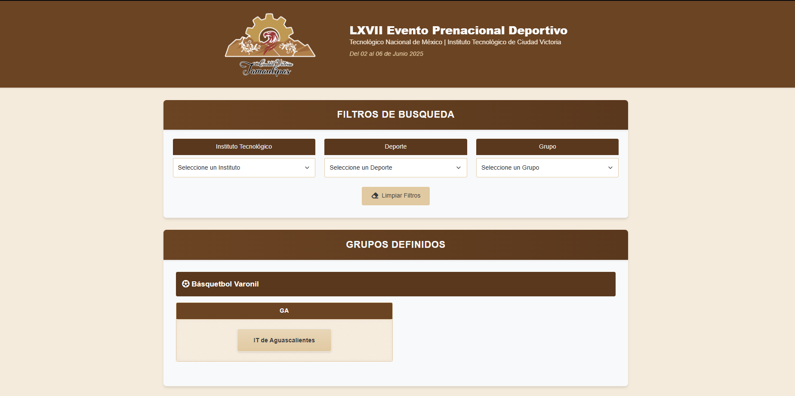
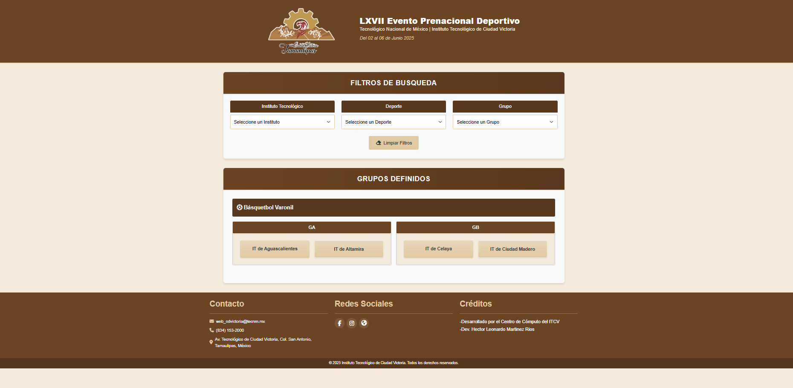
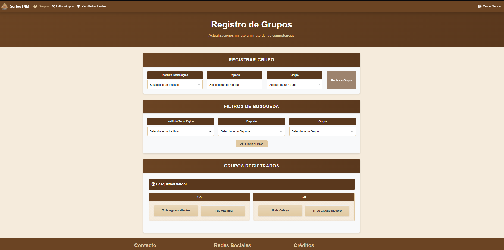
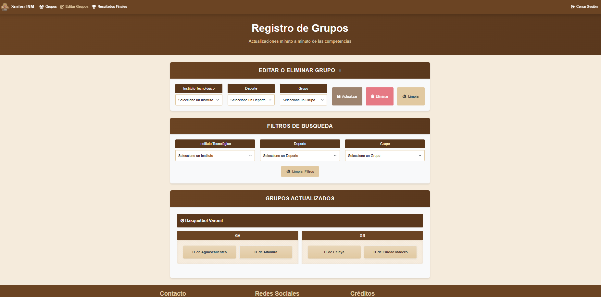
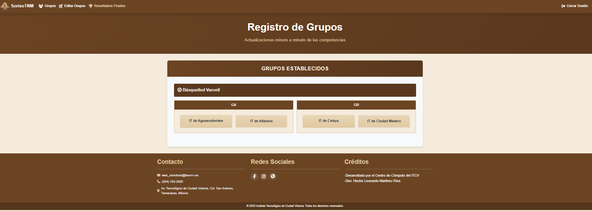

# SorteoTNM

## Sistema de Gestión de Grupos Deportivos (SorteoTNM)

El proyecto SorteoTNM es una aplicación web desarrollada para facilitar la organización de eventos deportivos del Tecnológico Nacional de México. Permite registrar, editar y visualizar grupos de diferentes instituciones tecnológicas participantes en diversas disciplinas deportivas.

## Características

- Visualización de grupos : Interfaz pública para consultar los grupos formados por deporte
- Filtrado de información : Búsqueda por institución, deporte y grupo
- Gestión de grupos : Registro, edición y eliminación de grupos (requiere autenticación)
- Autenticación de usuarios : Sistema de login para administradores
- Interfaz responsiva : Diseño adaptable a diferentes dispositivos

## Tecnologías

### Frontend (SorteoTNM)
- Framework : Angular 19
- Lenguaje : TypeScript
- Estilos : CSS con Bootstrap 5
- Comunicación : HttpClient para consumo de API REST

## Endpoints API

### Públicos
- POST / - Obtener grupos (con filtros opcionales)
- POST /loginST - Iniciar sesión
  
### Protegidos (requieren autenticación)
- POST /logoutST - Cerrar sesión
- POST /registerGrupoST - Registrar nuevo grupo
- PUT /edit-GruposST - Actualizar grupo existente
- POST /edit-GruposST - Obtener grupo por parámetros
- DELETE /edit-GruposST/:id - Eliminar grupo
- POST /resultadosST - Obtener resultados filtrados
  
## Vista previa

<p align="center">







</p>

## Development server

To start a local development server, run:

```bash
ng serve
```

Once the server is running, open your browser and navigate to `http://localhost:4200/`. The application will automatically reload whenever you modify any of the source files.

## Code scaffolding

Angular CLI includes powerful code scaffolding tools. To generate a new component, run:

```bash
ng generate component component-name
```

For a complete list of available schematics (such as `components`, `directives`, or `pipes`), run:

```bash
ng generate --help
```

## Building

To build the project run:

```bash
ng build
```

This will compile your project and store the build artifacts in the `dist/` directory. By default, the production build optimizes your application for performance and speed.

## Running unit tests

To execute unit tests with the [Karma](https://karma-runner.github.io) test runner, use the following command:

```bash
ng test
```

## Running end-to-end tests

For end-to-end (e2e) testing, run:

```bash
ng e2e
```

Angular CLI does not come with an end-to-end testing framework by default. You can choose one that suits your needs.

## Additional Resources

For more information on using the Angular CLI, including detailed command references, visit the [Angular CLI Overview and Command Reference](https://angular.dev/tools/cli) page.
